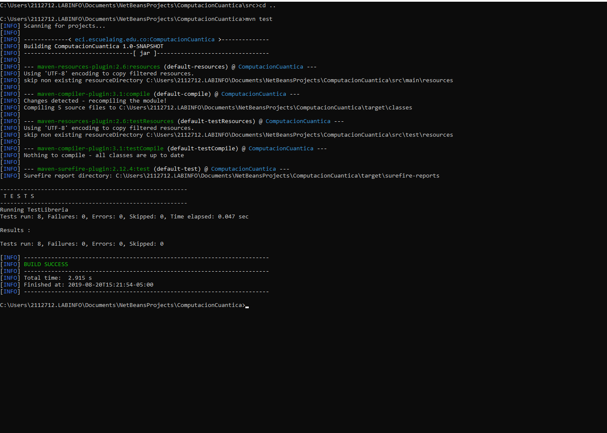
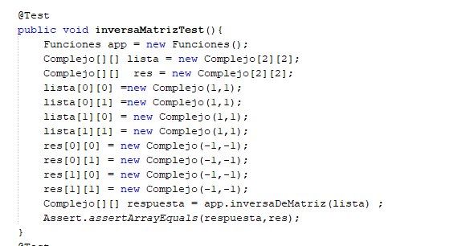

# Libreria Computacion Cuantica

_Esta libreria nos permitira realizar operaciones entre numeros complejos, los cuales consisten
en una tupla en la cual el primer numero corresponde a la parte real del numero complejo
y el segundo numero corresponde a la parte imaginaria_

## Funcionalidades 🚀

_Esta libreria le permitira realizar al usuario definir y realizar operaciones
entre numeros complejos, tambien permitira realizar operaciones entre matrices 
y vectores en los cuales su contenido son numeros complejos _

### Operaciones 🔧

* **Suma :**     Esta operacion recibe dos tuplas de numeros complejos y calcula su suma. 
* **Resta :**    La operacion "Resta" recibe dos tuplas de numeros complejos y calcula la resta  de ambos.
* **Producto :** Esta operacion recibe 2 tuplas de numeros complejos y calcula su producto.
* **Division :** Recibe dos tuplas de numeros complejos y calcula su division.
* **Modulo  :**  Recibe una tupla de numeros complejos y calcula su modulo.
* **Conjugado :** Calcula el conjugado de una tupla de numeros complejos.
* **Conversion Polar y Cartesiano :** recibe una tuplas, un modulo y una fase o angulo y retorna un numero complejo.
* **Retornar Fase :** calcula la fase o angulo de un numero complejo.
* **Adición de vectores complejos. :** Esta funcionalidad realiza la adicion de dos vectores cuyo contenido sean numeros complejos
* **Inversa de vectores complejos. :** Calcula la inversa aditiva de un vector de numeros complejos
* **Multiplicación escalar de vectores complejos. :** Calcula el vector resultante al multiplicar dicho vector con un escalar.
* **Adición de matrices complejos. :** Esta funcionalidad calcula la suma entre dos matrices de numeros complejos
* **Multiplicación escalar de matrices complejas. :** Calcula la multiplicacion de un escalar por una matriz de numeros complejos
* **Matriz transpuesta:** Calcula la transpuesta de una matriz de numeros complejos
* **acción de una matriz sobre un vector.:** 
* **Norma de matrices:** calcula la norma de una matriz
* **Distancia entrematrices:** calcula la distancia entre 2 matrices
* **Revisar si es unitaria:** permite identificar si una matriz es unitaria
* **Revisar si es Hermitian:** permite identificar si una matriz es hermitian
* **Producto tensor.:** calcula el producto tensor en matrices de numeros complejos
#


 # simulación de lo clásico a lo cuántico
 * **retos de programacion :**
    * **Programming drill 3.1.1 :** program that performs our little marble experiment. The program should allow the user to enter a              Boolean matrix that describes the ways that marbles move. Make sure that the matrix follows our requirement. The user should            also be permitted to enter a starting state of how many marbles are on each vertex. Then the user enters how many time clicks            she wants to proceed. The computer should then calculate and output the state of the system after those time clicks.
    * **Programming drill 3.2.1 :** Modify your program from Programming Drill 3.1.1 so
         that the entries in the matrices can be fractions as opposed to Boolean values.
     * **Programming drill 3.2.2 :** What would happen if there were more than two slits?Write a program that asks a user to design a            multislit experiment. The user notes the number of slits and the number of targets to measure the bullets. Then the user
         enters probabilities of the bullets’ moving from each slit to each target. An appropriate matrix is set up and then the matrix          is multiplied by itself. Have the program print the appropriate resulting matrix and vector.

### Pruebas 🛠️
_para cada una de las funcionalidades de este proyecto se creo su correspondiente prubea unitaria haciendo uso
de JUnit y Maven

## Ejecución de las pruebas 

**Compiling**
```
$ mvn clean compile
```
**Packing**
```
$ mvn package
```
**Running the tests**
```
$ mvn test
```


# Pruebas unitarias para vectores y matrices

* Se creo una prueba por cada metodo implementado en el laboratorio. 

* Ejemplo:
#


## Autores ✒️

* **Nicolas Patiño** 


---
