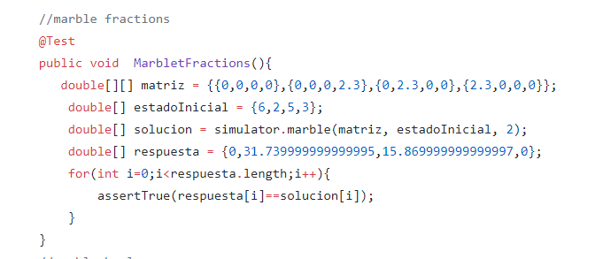

# Libreria Computacion Cuantica

_Esta libreria nos permitira realizar operaciones entre numeros complejos, los cuales consisten
en una tupla en la cual el primer numero corresponde a la parte real del numero complejo
y el segundo numero corresponde a la parte imaginaria_

## Funcionalidades 🚀

_Esta libreria le permitira realizar al usuario definir y realizar operaciones
entre numeros complejos, tambien permitira realizar operaciones entre matrices 
y vectores en los cuales su contenido son numeros complejos _

### Operaciones 🔧

* **Suma :**     Esta operacion recibe dos tuplas de numeros complejos y calcula su suma. 
* **Resta :**    La operacion "Resta" recibe dos tuplas de numeros complejos y calcula la resta  de ambos.
* **Producto :** Esta operacion recibe 2 tuplas de numeros complejos y calcula su producto.
* **Division :** Recibe dos tuplas de numeros complejos y calcula su division.
* **Modulo  :**  Recibe una tupla de numeros complejos y calcula su modulo.
* **Conjugado :** Calcula el conjugado de una tupla de numeros complejos.
* **Conversion Polar y Cartesiano :** recibe una tuplas, un modulo y una fase o angulo y retorna un numero complejo.
* **Retornar Fase :** calcula la fase o angulo de un numero complejo.
* **Adición de vectores complejos. :** Esta funcionalidad realiza la adicion de dos vectores cuyo contenido sean numeros complejos
* **Inversa de vectores complejos. :** Calcula la inversa aditiva de un vector de numeros complejos
* **Multiplicación escalar de vectores complejos. :** Calcula el vector resultante al multiplicar dicho vector con un escalar.
* **Adición de matrices complejos. :** Esta funcionalidad calcula la suma entre dos matrices de numeros complejos
* **Multiplicación escalar de matrices complejas. :** Calcula la multiplicacion de un escalar por una matriz de numeros complejos
* **Matriz transpuesta:** Calcula la transpuesta de una matriz de numeros complejos
* **acción de una matriz sobre un vector.:** 
* **Norma de matrices:** calcula la norma de una matriz
* **Distancia entrematrices:** calcula la distancia entre 2 matrices
* **Revisar si es unitaria:** permite identificar si una matriz es unitaria
* **Revisar si es Hermitian:** permite identificar si una matriz es hermitian
* **Producto tensor.:** calcula el producto tensor en matrices de numeros complejos
#


### Pruebas 🛠️
para cada una de las funcionalidades de este proyecto se creo su correspondiente prubea unitaria haciendo uso
de JUnit y Maven

## Ejecución de las pruebas 

**Compiling**
```
$ mvn clean compile
```
**Packing**
```
$ mvn package
```
**Running the tests**
```
$ mvn test
```


# Pruebas unitarias para vectores y matrices

* Se creo una prueba por cada metodo implementado en el laboratorio. 

* Ejemplo:
#


 # simulación de lo clásico a lo cuántico
 * **retos de programacion :**
    * **Reto  3.1.1 :** 
programa que realiza nuestro pequeño experimento de mármol. El programa debe permitir al usuario ingresar una matriz booleana que describa las formas en que se mueven las canicas. Asegúrese de que la matriz siga nuestro requisito. También se debe permitir al usuario ingresar un estado inicial de cuántas canicas hay en cada vértice. Luego, el usuario ingresa cuántos clics de tiempo desea continuar. Luego, la computadora debe calcular y generar el estado del sistema después de esos clics de tiempo.
    * **RETO 3.2.1 :** Modifique su programa del reto 3.1.1 para que
         que las entradas en las matrices pueden ser fracciones en oposición a los valores booleanos.
     * **RETO 3.2.2 :** Qué sucedería si hubiera más de dos rendijas? Escriba un programa que le pida a un usuario que diseñe un                 experimento multislit. El usuario anota el número de rendijas y el número de objetivos para medir las viñetas. Entonces el               usuario vingresa las probabilidades de que las balas se muevan de cada ranura a cada objetivo. Se configura una matriz                   apropiada y luego la matriz se multiplica por sí misma. Haga que el programa imprima la matriz y el vector resultantes                   apropiados.

     * **RETO 3.3.1 :** Modifique su programa del reto 3.2.1 para que permita que las entradas sean números complejos en lugar de fracciones.
     * **RETO 3.3.2:**  Modifique su programa del reto 3.2.2 para que permita que las transiciones de las muchas rendijas a los muchos dispositivos de medición sean números complejos. Su programa debe identificar dónde hay fenómenos de interferencia.
### Pruebas 🛠️    
**Compiling**
```
$ mvn clean compile
```
**Packing**
```
$ mvn package
```
**Running the tests**
```
$ mvn test
```

* Ejemplo:


* compilacion pruebas:

 

## Autores ✒️

* **Nicolas Patiño** 


---
